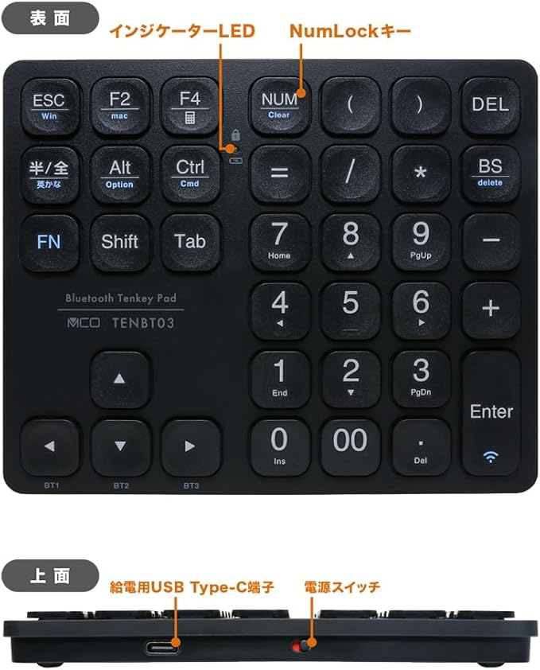

# TENBT03（MCO）キーマップ一覧

> **最終更新: 2026-04-21** — 初期化を取り消し、Complex 4件 + Simple 2件の状態に復元。

Karabiner-Elements の設定（`karabiner.json`）における **MCO TENBT03 Bluetooth テンキー**向けの参考メモです。



## デバイス識別

| 項目         | 値                                                |
| ---------- | ------------------------------------------------- |
| 製品例        | MCO TENBT03/BK Bluetooth ワイヤレステンキー（36キー） |
| vendor_id  | 9427                                              |
| product_id | 12427                                             |
| 識別子        | `is_keyboard: true` / `is_pointing_device: true`（合成デバイス扱い） |

## 現在のカスタム設定（`karabiner.json` 準拠）

### Complex Modifications（4件）

いずれも `device_if` で `vendor_id:9427 / product_id:12427` に限定。他デバイスの同じキーには発火しません。

| # | From（`key_code` / `modifiers.mandatory`） | To | 発火する物理キー（推定） |
|---|---|---|---|
| 1 | `delete_forward` | `spacebar` × 4 + `return_or_enter` | **DEL** キー |
| 2 | `f2` | `T` `e` `n` `t` `e` `n` `8` `2` `2` `3` + `return_or_enter` | **F2** キー |
| 3 | `8` + `mandatory: [shift, left_shift]` | `f13` | **`(`** キー（Shift+8 相当を送出） |
| 4 | `9` + `mandatory: [left_shift]` | `f13` + `left_shift` | **`)`** キー（Shift+9 相当を送出） |

**重要:**

- ルール 3 / 4 は **メイン数字列の `8` / `9` に対するルール**です。TENBT03 のテンキー部（`keypad_8` / `keypad_9`）は対象外。
- `optional: any` は **指定されていません**。つまり Ctrl / Option / Cmd を同時に押している場合は **発火しません**。
- TENBT03 物理の `(` / `)` キーは `Shift + 8` / `Shift + 9` を送出するため、この 2 ルールは実質「`(` 単押し → F13」「`)` 単押し → Shift+F13」として動作します。

### Simple Modifications（11件）

`profiles[].devices[]` 内の TENBT03 デバイスエントリに登録されています。

| From | To | メモ |
|------|------|------|
| `left_command`（物理 Ctrl / Cmd） | `apple_vendor_keyboard_key_code: spotlight` | TENBT03 は mac モードで物理 Ctrl が `left_command` を送出するため、Spotlight を開く |
| `keypad_num_lock` | `f6` | NumLock/Clear |
| `keypad_slash` | `f11` | ÷ |
| `keypad_plus` | `consumer_key_code: volume_increment` | 音量アップ |
| `keypad_hyphen` | `consumer_key_code: volume_decrement` | 音量ダウン |
| `f4` | `n` + `command`（⌘N） | 物理 **F4** キーで新規作成/新規ウィンドウ |
| `tab` | `delete_or_backspace` + `command`（⌘Delete） | 削除系ショートカット |
| `down_arrow` | `fn` | FN 相当 |
| `up_arrow` | `return_or_enter` | Enter |
| `left_arrow` | `tab` + `control` + `shift` | 前のタブ |
| `right_arrow` | `tab` + `control` | 次のタブ |

### Fn Function Keys

**なし**

### デバイスエントリのその他設定

```json
{
  "ignore": false,
  "disable_built_in_keyboard_if_exists": false,
  "manipulate_caps_lock_led": false
}
```

## グローバル複合ルールの適用

同一プロファイル（`240106`）のグローバル複合ルールのうち、⌘短押しで IME 切替するルールは TENBT03（`9427:12427`）を `device_unless` で除外しています。物理 Ctrl/Cmd が `left_command` として届くため、IME 誤発火を避けるための二重保険です。

## 物理キー一覧（TENBT03 実機仕様・写真ベース）

MCO TENBT03 は **36キー（FN含む）** の Bluetooth テンキー。実機写真で確定した配列は以下（過去に Web 情報が「四則演算キーなし」と誤報していたが、実機には + − × ÷ 相当（`keypad_plus` / `keypad_hyphen` / `keypad_asterisk` / `keypad_slash`）と `=`、`00`、専用 `(` `)`、`NUM(Clear)`、`半/全`、`FN` が全部ある）。

### 全体構造

- **左側ブロック**: 3 列 × 3 行（ファンクション・修飾キー）
- **方向キー列**: 独立 4 キー（▲ / ◀ / ▼ / ▶、一部に BT1/BT2/BT3 サブラベル）
- **右側テンキーブロック**: 4 列 × 6 行（Enter は縦 2 行ぶち抜き）

### 左ブロック（3 × 3）

| 物理キー（上段メイン / 下段サブラベル） | 入力 key_code |
|----------------------------------------|----------------|
| **ESC** / Win（FN+ESC で Windows モード） | `escape` |
| **F2** / mac（FN+F2 で macOS モード）     | `f2` |
| **F4** / 電卓（Windows 時に電卓起動）     | `f4`（Simple Mod で `command` + `n` に変換） |
| **半/全** / 英かな                         | `grave_accent_and_tilde` / `japanese_eisuu` 等（モード差あり） |
| **Alt** / Option                           | `left_option`（Simple Mod で `mute`(consumer) に変換） |
| **Ctrl** / Cmd                             | ハード仕様で `left_command` を送出（Simple Mod で Spotlight に変換） |
| **FN**                                     | **イベント非発行（ハードウェア処理）** |
| **Shift**                                  | `left_shift` |
| **Tab**                                    | `tab` |

### 方向キー列（独立 4 キー）

| 物理キー | サブラベル | 入力 key_code |
|---------|-----------|----------------|
| ▲       | （なし）   | `up_arrow` |
| ◀       | BT1       | `left_arrow` |
| ▼       | BT2       | `down_arrow` |
| ▶       | BT3       | `right_arrow` |

FN 併用で ◀/▼/▶ が Bluetooth チャンネル 1/2/3 の切替に対応（ハードウェア側で処理）。

### 右ブロック（4 列 × 6 行・Enter は縦 2 行）

行ごとに記載（列 1→列 4）。NumLock OFF 時の副機能をカッコで併記。

| 行 | 列 1 | 列 2 | 列 3 | 列 4 |
|----|------|------|------|------|
| 1 | **NUM**（Clear） | **(** | **)** | **DEL** |
| 2 | **=** | **/** | **\*** | **BS**（delete） |
| 3 | **7**（Home） | **8**（▲） | **9**（PgUp） | **−** |
| 4 | **4**（◀） | **5** | **6**（▶） | **+** |
| 5 | **1**（End） | **2**（▼） | **3**（PgDn） | **Enter**（3-4 行ぶち抜き） |
| 6 | **0**（Ins） | **00** | **.**（Del） | （Enter 続き） |

各キーの入力 key_code（macOS モード・NumLock ON 想定）:

| 物理キー | 入力 key_code | NumLock OFF の副機能 |
|---------|---------------|---------------------|
| NUM     | `keypad_num_lock`（Clear） | — |
| `(`     | `8` + `shift`（Shift+数字列キーと同等） | — |
| `)`     | `9` + `shift` 相当 | — |
| DEL     | `delete_forward` | — |
| `=`     | `keypad_equal_sign`（または `equal_sign`） | — |
| `/`     | `keypad_slash` | — |
| `*`     | `keypad_asterisk` | — |
| BS      | `delete_or_backspace` | — |
| `−`     | `keypad_hyphen` | — |
| `+`     | `keypad_plus` | — |
| Enter   | `keypad_enter` | — |
| 0       | `keypad_0` | Insert |
| 00      | `keypad_0` × 2 相当 | — |
| 1       | `keypad_1` | End |
| 2       | `keypad_2` | ↓ (`down_arrow`) |
| 3       | `keypad_3` | Page Down |
| 4       | `keypad_4` | ← (`left_arrow`) |
| 5       | `keypad_5` | （無機能） |
| 6       | `keypad_6` | → (`right_arrow`) |
| 7       | `keypad_7` | Home |
| 8       | `keypad_8` | ↑ (`up_arrow`) |
| 9       | `keypad_9` | Page Up |
| `.`     | `keypad_period` | Delete |

### モード切替（FN併用）

| 操作        | 機能                   |
|-------------|------------------------|
| FN + ESC    | Windows モード         |
| FN + F2     | macOS モード           |
| FN + Enter 長押し | Bluetoothペアリング |
| FN + F4     | 電卓起動（Windows想定） |
| FN + ◀      | Bluetooth チャンネル 1 |
| FN + ▼      | Bluetooth チャンネル 2 |
| FN + ▶      | Bluetooth チャンネル 3 |

## 履歴

- 2026-04-12: TENBT03 向けの全カスタム設定をリセット（`karabiner.json.bak.tenbt03_reset_20260412123508`）
- 2026-04-20: `delete_forward` / `f2` / `(`→F13 / `)`→Shift+F13 を追加（`karabiner.json.bak.tenbt03_lshift_20260420180820`）
- 2026-04-21: `left_option` → `japanese_eisuu` の Simple Mod を削除（`karabiner.json.bak.tenbt03_leftopt_20260421130312`）
- 2026-04-21: 完全初期化（`karabiner.json.bak.tenbt03_fullreset_20260421131300`）
- 2026-04-21: **初期化を取り消してロールバック**。Complex 4件 + Simple 2件の状態に復元（初期化後の状態は `karabiner.json.bak.after_fullreset_*` に保存）
- 2026-04-21: 実機写真ベースで物理キー一覧を修正。四則演算キー（+ − × ÷ 相当）・`=`・`/`・`*`・`00`・`NUM(Clear)`・方向キー独立配置を反映。過去の「Excel 特化配列」「四則演算なし」記述は Web 情報の誤りだったため削除。
- 2026-04-21: **Ctrl(Cmd) キー押下で英数が出る問題を修正**。TENBT03 の物理 Ctrl キーは mac モード時に `left_command` を送出するため、グローバルルール「⌘ 短押しで IME」に巻き込まれていた。`device_unless.identifiers` に `9427:12427` を追加して除外（`karabiner.json.bak.tenbt03_cmd_ime_exclude_20260421133620` / `scripts/tenbt03_exclude_from_cmd_ime.py`）。
- 2026-04-21（以降）: Simple Modifications を 2件 → 3件 に変更。`f4`→`launchpad` を `f4`→`fn` に変更、`left_command`→`mission_control` を追加。これにより TENBT03 の物理 Ctrl(Cmd) キーは Mission Control を開く動作になった（IME ルールの `device_unless` は二重保険として残存）。
- 2026-04-30: Simple Modifications を 11件に更新。`f4`→`command+n` を追加し、現行の `left_command`→Spotlight / 方向キー系 / 音量系の割り当てを表へ反映。

## 注意

- **FN キーは OS にイベントを送らない**ことが多く、Karabiner 側ではリマップできません（メーカー仕様）。
- **NumLock は TENBT03 内部状態**。Windows では青LEDで状態を示し、macOS モードでは常時ナビゲーション寄りの挙動になる場合があります。
- **ルール 3 / 4 は `optional: any` 未指定のため、Ctrl / Option / Cmd 併用時は発火しません**。併用でも発火させたい場合は `optional: ["any"]` を追加する必要があります。
- **Shift+8 / Shift+9（物理 `(` / `)` キー経由）は `f13` / `Shift+f13` に変換されるため**、このデバイスから Excel で `(` や `)` を直接入力することはできません。
- **物理キー一覧は実機写真（2026-04-21 取得）が一次情報**。Web 検索で得た仕様情報と食い違う場合は実機写真を正とする。
- **Ctrl(Cmd) キーのハード仕様**: TENBT03 は mac モード時に物理 Ctrl キーの HID 送出を `left_command` に入れ替える。そのためグローバルルール「⌘ 短押しで IME」に巻き込まれて英数が出る副作用があった。2026-04-21 時点で **TENBT03 をそのルールの `device_unless` に追加して除外済み**。現行 Simple Mod では `left_command`→Spotlight に変換している。
