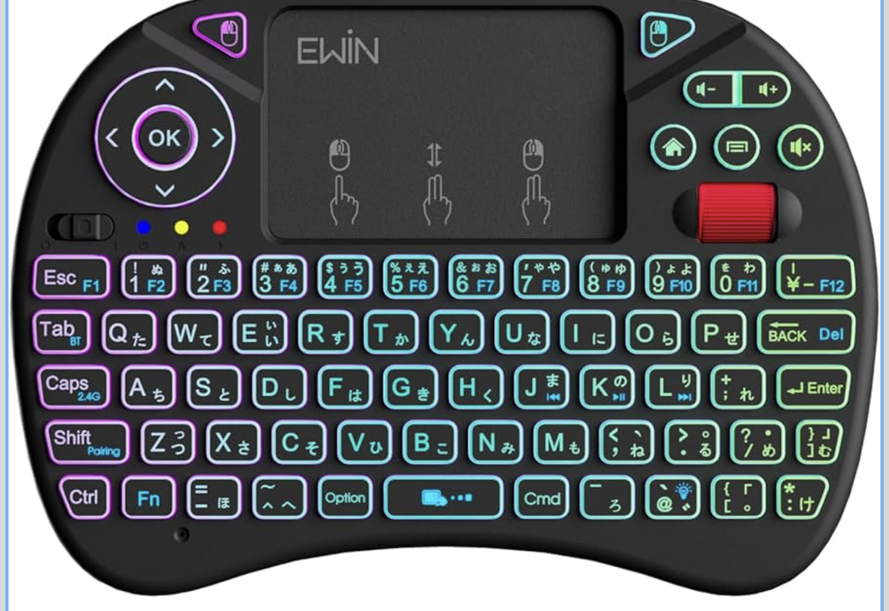

# X8 BLE Keyboard キーマップ一覧

Karabiner-Elements の設定（`karabiner.json`）における **X8 BLE Keyboard** 向けマッピングです。

## デバイス識別

| 項目         | 値                                                                                        |
| ---------- | ---------------------------------------------------------------------------------------- |
| 製品例        | X8 BLE Keyboard                                                                          |
| vendor_id  | 1452                                                                                     |
| product_id | 599                                                                                      |
| 備考         | 下記「X8 BLE Keyboard - カスタム設定」内のルールは `device_if` で X8 のみ |

## 複合ルール

ルールグループ名: **X8 BLE Keyboard - カスタム設定**

| #   | 入力                                | 出力・動作                                               |
| --- | --------------------------------- | --------------------------------------------------- |
| 1   | Caps Lock                         | 英数 ⇔ かなのトグル（内部変数 `x8_ble_caps_ime`）                 |
| 2   | ポインティング button1（左クリック相当）          | 音声入力（dictation）                                     |
| 3   | ポインティング button2（右クリック相当）          | Space × 4 → Enter                                    |
| 4   | ポインティング button3（中クリック相当のことが多い）    | `left_command`                                       |
| 5   | `application` キー                  | アプリケーションのウィンドウ（osascript: Control + ↓、key code 125） |
| 6   | Consumer `ac_home`                | デスクトップ表示（osascript: F11 相当、key code 103）            |
| 7   | Consumer `mute`                   | Mission Control（`mission_control`）                  |
| 8   | Consumer `volume_decrement`（音量下げ） | Command + C                                          |
| 9   | Consumer `volume_increment`（音量上げ） | Command + V                                          |
| 10  | 数字 0〜9                            | keypad_0〜9（半角数字化）                                   |
| 11  | F2                                | Shift+F13（Magic Keyboard と同じ設定）                    |
| 12  | F3                                | Control+K（Magic Keyboard と同じ設定）                     |
| 13  | F4                                | Tenten8223+Enter（osascript、Magic Keyboard と同じ設定）   |
| 14  | F7                                | Option+H（Magic Keyboard と同じ設定）                      |

### スクロール量（別ルール）

ルール名: **X8 BLE: Fn+トラックパッド移動→スクロール（speed_multiplier 2.0）**

| 条件                              | 動作                                                                                 |
| ------------------------------- | ---------------------------------------------------------------------------------- |
| **Fn を押したまま** X8 のトラックパッドで指を動かす | その移動が **スクロール** として送られ、`speed_multiplier` **2.0** で量が増える（`mouse_motion_to_scroll`） |

**補足:** Karabiner 標準では **物理ホイールの「1ノッチあたりのデルタ」を直接倍にする**ことはできません。ホイールだけ速くしたい場合は **システム設定 → マウス** のスクロール速度や、**Mos** などのユーティリティを検討してください。

## デバイス別 Simple Modifications

| 入力               | 出力                        |
| ---------------- | ------------------------- |
| `f1`             | `print_screen`（Magic Keyboard と同じ設定） |
| `left_arrow`     | `delete_or_backspace`     |
| `right_arrow`    | `return_or_enter`         |

## システムショートカットとの関係

以下は macOS の **キーボードショートカット** の既定に依存します。変更している場合は `karabiner.json` 内の `shell_command` や `key_code` を合わせて調整してください。

- アプリケーションのウィンドウ: Mission Control の「アプリケーションのウィンドウを表示」（既定は Control + ↓）
- デスクトップ表示: 「デスクトップを表示」（既定は F11）

## 注意

- button1 を音声入力にしているため、**タッチパッドの左クリックが音声入力に置き換わります**。
- button2 は Space × 4 → Enter にしているため、**右クリック相当のボタンは使えません**。
- button3 は `left_command` を送出します。クリック同時押し用途ではなく、Command単体の入力として扱います。
- X8 の **物理 ⌘ は F13** です。**Control → Command の複合ルールは X8 には掛けていない**（OS 既定の Control のまま）。
- 複合ルールの変更後は Karabiner-Elements が `karabiner.json` を読み直すまで反映されない場合があります。
